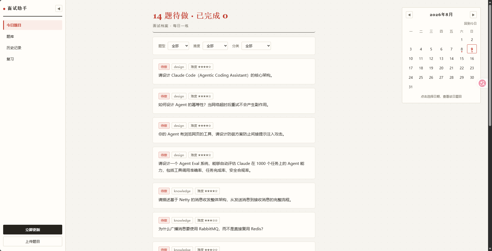
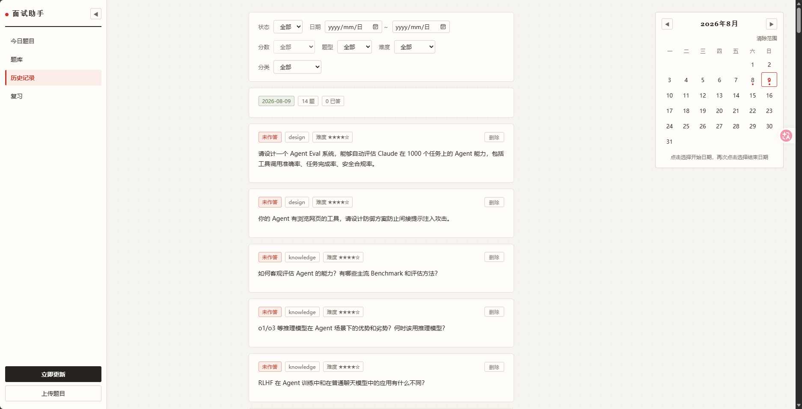
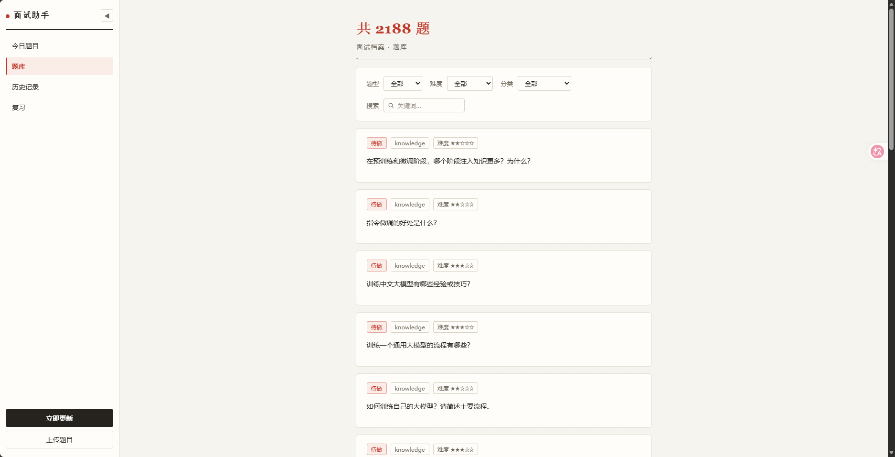
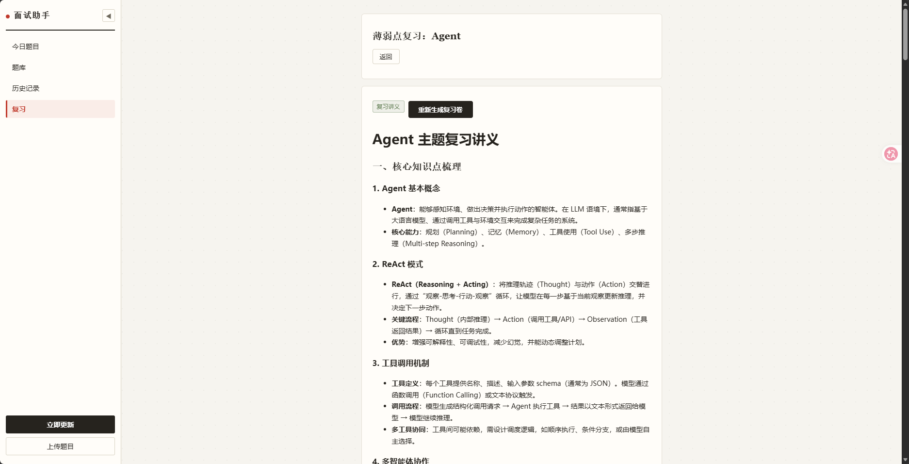

# 面试助手 InterviewAssistant

把"看面经"升级为"模拟被问 + 获得判分反馈"的个人求职准备工具：每天自动从牛客/GitHub 面经仓库采集最新面经，基于面经生成面试题，向你提问，答案由 LLM 按面试官标准四维判分并给出可行动的反馈。

求职方向：**LLM 应用开发 / Agent 开发**。

## 核心特性

- **自动化闭环**：每日定时增量采集面经 → 自动出题 → 用户作答 → LLM 四维判分 + 薄弱点标签沉淀
- **双源出题**：面经题（knowledge 知识型 / design 场景设计题）+ 简历项目深挖题（project）
- **深挖追问链**：五层深度阶梯（概念→原理→权衡→边界→横向）追问到"不会为止"，连续 2 次差评探到底；判分 depth 按探到层级校准
- **判分一致性**：good/bad criteria 随题生成、judge 引用判分；参考检索注入库内同类高分回答（hit_rate/MRR 评估达标上线）
- **薄弱点复习**：判分 weak_tags 聚合 → 按标签检索同类题复习（未做优先）
- **语义去重**：bge-m3 embedding 余弦阈值（0.85）防重复题堆积
- **成本可控**：生成用便宜模型 + 每日 36 题生成上限 + 整轮统一判分 + 分批生成防输出截断

## 快速开始

```bash
uv pip install -r requirements.txt
# GPU torch（cu124，lock 已 pin 该版本；CPU 版 embedding 会慢 10 倍+）：
uv pip install torch --index-url https://download.pytorch.org/whl/cu124
cp config.yaml 配置到你的实际值（可选）
# 密钥写入 .env（不落 git）：
# LLM_API_KEY=sk-xxx
# NOWCODER_COOKIE=浏览器 DevTools 复制
uv run uvicorn app.main:app --host 127.0.0.1 --port 8000
```

打开 http://127.0.0.1:8000 使用。默认每日 08:00 自动跑流水线，也可点页面「立即更新」。

## 界面预览

| 今日题目（日历单选 + 星级难度） | 历史记录（日期范围日历） |
|---|---|
|  |  |

| 题库（关键词/难度筛选） | 薄弱点复习（LLM 复习讲义） |
|---|---|
|  |  |

> 首次「立即更新」会 clone 面经仓库 + 用 LLM 生成 36 道题，耗时 10-20 分钟（一次性成本）；之后每日增量运行很快。
> 牛客源需 .env 中配置有效 `NOWCODER_COOKIE`（登录后 F12 复制），cookie 过期会自动安静停用该源，GitHub 源与手动导入不受影响（详见 docs/modules/M06-nowcoder.md）。

手动导入面经/简历：

```bash
uv run python -m app import 面经.md --type manual
uv run python -m app import 简历.md --type resume   # 触发 project 题生成
# 内置后端通用知识素材（缓存/并发/设计模式等，Python+Java 双视角，见 docs/后端知识入库方案.md）：
uv run python -m app import data/面经-后端通用.md --type manual
```

运行测试（全离线，不触网）：

```bash
uv run pytest
```

## 架构

```
┌─ 数据采集层 ────┐   ┌─ 生成层 ─────┐   ┌─ 交互层 ────┐   ┌─ 判分层 ────┐
│ nowcoder 爬虫   │   │ 清洗/规范化   │   │ 今日题目列表 │   │ 四维判分     │
│ github 仓库拉取  │ → │ 哈希+LLM去重  │ → │ 答题页(追问链)│ → │ 参考答案生成  │
│ 手动导入 CLI    │   │ 题目生成(LLM) │   │ 历史/判分展示 │   │ 薄弱点标签提取 │
└───────┬────────┘   └──────┬───────┘   └──────┬─────┘   └──────┬──────┘
        └─────────────────── SQLite (SQLModel) ────────────────┘
```

模块拓扑（docs/MODULES.md 有完整设计）：

```
M1 config → M2 models/storage → M3 llm_client
M4 clean → M8 generate → M9 dedup → M12 daily → M13 scheduler
M5 importer ┘            ▲          │
M6 nowcoder ─────────────┘          ▼
M7 github ─────────────→ M10 judge → M11 chain → M14 web/routes
```

## 设计决策摘要

| 编号 | 决策 |
|---|---|
| D5 | LLM 多 provider 可配置（DeepSeek 默认），生成/判分模型分离 |
| D7 | 题型 knowledge/design/project，good/bad criteria 随题生成 |
| D8 | 每日待做配额：knowledge 3-5 / design 1-2 / project 0-1 |
| D15 | 追问链 20 轮上限，可提前 finish |
| D16 | 每日新入库不重复问题 ≤36 |
| D17 | 总分 = accuracy×30% + completeness×30% + clarity×20% + depth×20% |
| D18 | 中断会话从 attempts 断点恢复 |

完整决策记录见 docs/DESIGN.md。

## 与同类项目的差异

现有项目多为"用户手动喂数据→模拟面试"或"静态面经库"。本项目的差异：

1. **每日定时增量采集面经自动出题**（现有项目无自动闭环）
2. **面经题 + 简历深挖题双源出题**（比单一题库覆盖面更全）
3. **判分引用随题生成的 criteria**（一致性强于 judge 自由发挥）
4. **MVP 用 SQL 过滤 + LLM 去重，RAG 按检索评估（hit_rate/MRR）验收后才引入**（避免为技术而技术）

## 技术栈

FastAPI + SQLModel/SQLite + openai SDK + httpx + BeautifulSoup4 + APScheduler + sentence-transformers（bge-m3, GPU）+ pytest（uv 管理依赖）。

## 目录

```
app/
├── main.py            # FastAPI 入口（启动调度器）
├── config.py          # M1 配置加载（.env 密钥）
├── models.py / db.py  # M2 数据模型与存储（含幂等迁移）
├── scheduler.py       # M13 每日调度
├── tags.py            # 共享标签词表（58 词，6 大类）
├── embed.py           # E1 bge-m3 向量化（语义去重/检索）
├── retrieval.py       # E2 检索（text/vector/hybrid）+ 高分回答参考组装
├── llm/llm_client.py  # M3 LLM 客户端（重试/JSON 解析/max_tokens）
├── crawler/           # M5 importer / M6 nowcoder / M7 github
├── pipeline/          # M4 clean / M8 generate / M9 dedup / M12 daily
├── judge/             # M10 judge / M11 chain（深挖追问）
└── web/               # M14 路由 + 静态页（侧边栏导航）
scripts/               # 运维脚本（检索评估 / 旧题标签迁移）
tests/                 # 251 个用例，全离线
docs/                  # DESIGN / MODULES / 模块设计 / 方案 / 审查与修复记录
```

## 安全

- API key / cookie 一律走 `.env`（gitignore 排除），配置只声明变量名
- 服务只绑 127.0.0.1
- 牛客源：随机间隔限速 + 重试退避 + 登录态失效安静停用
